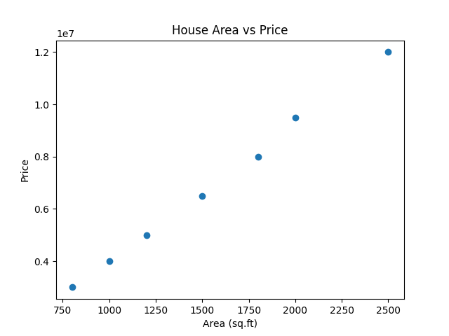
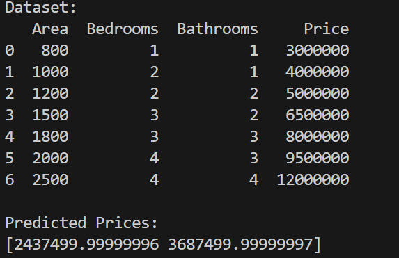

# 🏠 House Price Prediction Using Machine Learning

## 📌 Project Overview
This project predicts the **price of a house** based on factors such as **area, number of bedrooms, and bathrooms** using a **Machine Learning prediction algorithm**.  
The model is built using **Linear Regression**, which is suitable for predicting continuous values like house prices.

---

## 🎯 Objective
To develop a machine learning model that can estimate house prices accurately using historical housing data.

---

## 🧠 Algorithm Used
- **Linear Regression**
- Type: **Supervised Learning**
- Category: **Prediction Algorithm**

---

## 🛠️ Tools & Technologies
- **Programming Language:** Python  
- **IDE:** VS Code  
- **Libraries Used:**
  - Pandas
  - NumPy
  - Scikit-learn
  - Matplotlib

---

## 📂 Project Structure

